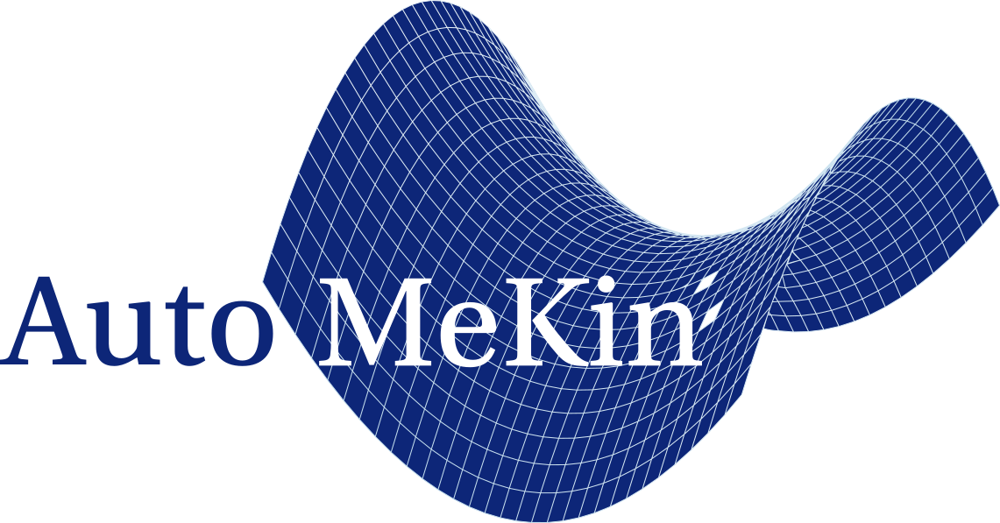

# AutoMeKin

<p align="center">
   
</p>

AutoMeKin (formerly known as tsscds) is a computer program that has been designed to discover reaction mechanisms and solve the kinetics in an automated fashion. AutoMeKin obtains transition state guess structures from trajectory simulations of the highly vibrationally excited species. From the obtained TS structures, minima and product fragments are determined following the intrinsic reaction coordinate. Finally, having determined the stationary points, the reaction network is constructed and the kinetics is solved. The program is interfaced with MOPAC2016 and Gaussian 09 (G09).

A computer program for finding reaction mechanisms and solving the 
kinetics.

## Authors
* Emilio Martinez-Nunez
* George L. Barnes
* Sabine Kopec
* Daniel Pelaez-Ruiz
* Aurelio Rodriguez
* Roberto Rodriguez-Fernandez
* James J. P. Stewart
* Saulo A. Vazquez

## LICENSE

This program is free software: you can redistribute it and/or modify it under the terms of the GNU General Public License as published by the Free Software Foundation, either version 3 of the License, or any later version.

This program is distributed in the hope that it will be useful, but WITHOUT ANY WARRANTY; without even the implied warranty of MERCHANTABILITY or FITNESS FOR A PARTICULAR PURPOSE.  See the GNU General Public License for more details.

You should have received a copy of the GNU General Public License along with this program.  If not, see <http://www.gnu.org/licenses/>.

## INSTALLATION INSTRUCTIONS

Once you have downloaded the source code, untar and unzip the file:

``
tar xvfz Amk-SOURCE-2018.tar.gz
``

or clone the code from github:

``
git clone https://github.com/emartineznunez/AutoMeKin.git AutoMeKin
``

### DEPENDENCIES

Before installing amk for the first time, be aware that the following packages are needed:

- **[GNU Bash](https://www.gnu.org/software/bash/)**
- **[GNU bc](https://www.gnu.org/software/bc/)**
- **[GNU Awk (gawk)](https://www.gnu.org/software/gawk/)**
- **[GNU C Compiler (gcc)](https://gcc.gnu.org/)**
- **[Gnuplot](http://www.gnuplot.info/)**
- **[GNU Fortran Compiler (gfortran)](https://gcc.gnu.org/wiki/GFortran)**
- **[GNU Parallel](https://www.gnu.org/software/bash/manual/html_node/GNU-Parallel.html)**
- **[NumPy](https://www.numpy.org/)**
- **[SciPy](https://www.scipy.org/)**
- **[SQLite](https://www.sqlite.org/index.html)** (version >= 3)
- **[Zenity](https://wiki.gnome.org/Projects/Zenity)**

You can install the missing ones manually, or you can use the scripts located in amk-SOURCE-2018 and called 
install-required-packages-distro.sh (where distro=ubuntu-16.4lts, centos7 or sl7), which will do the work for you.
The ubuntu-16.4lts script installs all dependencies, but for the RHEL derivatives (centos7 and sl7) you have 
to install parallel separately, and you have two choices:

1. **install-gnu-parallel-from-source.sh**. This script installs parallel latest version from source thanks to Ole Tange (the author). Also it can fallback to a user private installation into $HOME/bin if you have not administrator permisions to install it globally.

2. **install-gnu-parallel-from-epel.sh**. Enables the EPEL repository and installs parallel from it.

The program runs using two levels of theory: semiempirical (or Low-Level LL) and ab initio/DFT (or High-Level HL). 
So far, the only program interfaced with amk to perform the ab initio/DFT calculations is G09. Therefore, 
if you want to perform the HL calculations G09 should be installed and should run like in this example: 

``
g09 < inputfile > outputfile
``

These packages might also be useful to analyze the results:

1. **[molden](http://cheminf.cmbi.ru.nl/molden/)**
2. **[sqlitebrowser](https://github.com/sqlitebrowser/sqlitebrowser)**

### INSTALLATION

Once the above packages are installed, either:

Go to AutoMeKin if you cloned it from github

```
cd AutoMeKin
```

or go to the amk-SOURCE-2018 folder, if you downloaded the tarball.

```
cd amk-SOURCE-2018
```

In both cases, the process continues the same way. Now type:

```
./configure
```

This will install amk in $HOME/amk-2018 by default. If you want to install it in a different directory, type:

```
./configure --prefix=path_to_program
```

Finally, complete the installation:

```
make
make install
make clean
```

The last command (make clean) is only necessary if you want to remove from the src directory the object files 
and executables created in the compilation process.

For convenience, and once “Environment Modules” has been installed, you should add the following line to your .bashrc file:

```
module use path_to_program/modules
```

where path_to_program is the path where you installed amk (e.g., $HOME/amk-2018).

### PROGRAM EXECUTION

To start using any of the scripts of the program, you have to load amk/2018 module:

```
module load amk/2018
```

To run the low-level calculations use:

```
nohup llcalcs.sh molecule.dat ntasks niter runningtasks >llcalcs.log 2>&1 &
```

where:
molecule is the name of your molecule
ntasks is the number of tasks
niter is the number of iterations
runningtasks is the number of simultaneous tasks

To run the high-level calculations use:

```
nohup hlcalcs.sh molecule.dat runningtasks >hlcalcs.log 2>&1 &
```

For more details, follow the instructions given in the tutorial.
